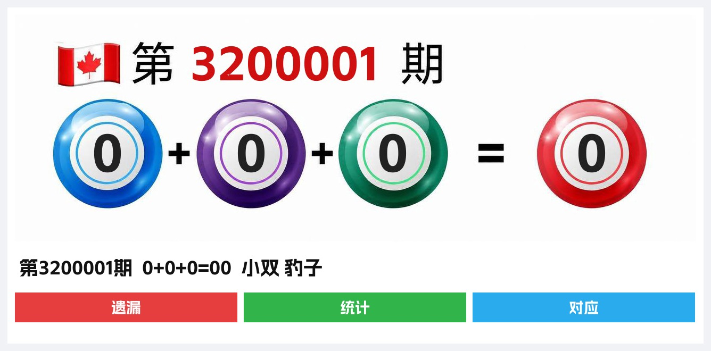

# Telegram PC28 开奖播报（频道版）

面向 Telegram **频道**的加拿大 28（PC28）开奖自动播报机器人。

新开奖到达后，自动向频道发送图文消息。数据来自 [yu28 开放接口](https://yu28.top/developers/open-api.llms.md)。开源分享，允许二开与商用。

[](LICENSE)
[](https://go.dev/)

**作者**：[Telegram @yuuu](https://t.me/yuuu)

---

## 功能特性

| 能力 | 说明 |
| --- | --- |
| 开奖播报 | 新开奖自动推送到频道，每期不漏、不重复 |
| 图文消息 | 开奖图 + 文字说明；图片异常时仍以文字完整播报 |
| 消息按钮 | 统计（yu28 未开遗漏弹窗）、预测开奖网、南宫集团官方频道 |
| 私信调试 | `DEBUG_DM=1` 时不向频道发送；私信发送 `1` 预览本期图文 |

---

## 效果示例

频道消息为 **开奖图 + 文字说明**。以下为真实渲染效果示意：

### `0+0+0=00`（小双 豹子）



### `9+9+9=27`（大单 豹子）


> 重新生成示例图：`go run ./tools/gen_examples/`

---

## 系统架构

```text
                 ┌─────────────────────────┐
                 │   yu28.top JSON API     │
                 │  /api/kj.json           │
                 └───────────┬─────────────┘
                             │ HTTP 轮询 + X-Api-Key
                             ▼
┌──────────────┐     ┌───────────────┐     ┌────────────────────┐
│   main.go    │────▶│  draw monitor │────▶│ drawCh (新期号)     │
│  启动编排     │     │  500ms 轮询    │     └─────────┬──────────┘
└──────────────┘     └───────────────┘               │
                                                     ▼ lastQ 去重
                                            ┌────────────────────┐
                                            │ TelegramService    │
                                            │ Broadcast → queue  │
                                            │ sendWorker 串行发送 │
                                            └─────────┬──────────┘
                                                      │
                         ┌────────────────────────────┼──────────────┐
                         ▼                                           ▼
                  开奖图渲染/上传                           sendMessage / sendPhoto
                  失败→纯文字降级
```

### 数据源

| 接口 | 用途 |
| --- | --- |
| `{YU28_BASE}/api/kj.json` | 最新开奖（期号 `nbr`、三位和式 `number`、组合） |
| `{YU28_BASE}/api/yl.json` | 未开遗漏（统计按钮按需拉取） |

身份用期号 `nbr`，不用「最新一条」。个人 Key 只走请求头 `X-Api-Key`，禁止写成 `?key=`。

本项目**不依赖**数据库或 Redis。

---

## 技术栈

- **语言**：Go 1.25+
- **Telegram**：[go-telegram-bot-api/v5](https://github.com/go-telegram-bot-api/telegram-bot-api)
- **图片**：`golang.org/x/image` + FreeType 字体渲染
- **配置**：`.env`（`godotenv`）
- **产物名**：`bobao`（`make build`）

---

## 目录结构

```text
.
├── main.go                 # 进程入口：配置、初始化、主循环
├── Makefile                # build / linux / test
├── go.mod / go.sum
├── .env.example            # 环境变量模板（勿提交真实密钥）
├── assets/
│   ├── draw_bg.jpg         # 开奖图底图
│   ├── AlimamaShuHeiTi-Bold.ttf
│   └── examples/           # README 效果示例图
├── tools/
│   └── gen_examples/       # 生成示例图
├── config/
│   └── config.go           # 环境变量加载与校验
└── service/
    ├── http.go             # DNS pin、通用 HTTP GET
    ├── draw.go             # 开奖轮询与 JSON 解析
    ├── telegram.go         # 播报队列与发送
    ├── draw_image.go       # 开奖图渲染
    └── draw_test.go        # 解析单测
```

---

## 快速开始

### 1. 环境要求

- Go 1.25 或更高版本
- 可用的 Telegram Bot Token
- Bot 已加入目标频道，并具备发消息权限
- yu28 开放接口个人 Key

### 2. 配置

```bash
cp .env.example .env
```

编辑 `.env`：

```env
TELEGRAM_BOT_TOKEN=123456:ABC...
TELEGRAM_CHANNEL_ID=-100xxxxxxxxxx
YU28_API_KEY=
YU28_BASE=https://yu28.top
DEBUG_DM=1
```

| 变量 | 必填 | 说明 |
| --- | --- | --- |
| `TELEGRAM_BOT_TOKEN` | 是 | BotFather 发放的 Token |
| `TELEGRAM_CHANNEL_ID` | 是 | 频道数字 ID（通常为负数） |
| `YU28_API_KEY` | 是 | yu28 个人 Key，请求时放进 `X-Api-Key` |
| `YU28_BASE` | 否 | 默认 `https://yu28.top` |
| `DEBUG_DM` | 否 | `1` / `true` / `yes` / `on` 时不向频道播报，仅私信 `1` 预览 |

### 3. 编译与运行

```bash
# 本机产物
make build
./bobao

# Linux amd64 交叉编译
make linux

# 测试
make test
```

运行目录需能读取 `assets/` 与写入 `bobao.log`（建议在项目根目录启动）。

---

## 运行时行为

1. **启动**：加载配置 → 初始化 Telegram / 开奖图 / yu28 客户端 → 拉取当前最新期号作为 `lastQ`，并监听 Bot 更新。
2. **检测**：独立协程每 500ms 请求 `kj.json`；仅当期号大于 `lastQ` 时写入 `drawCh`。
3. **播报**：主循环去重后调用 `Broadcast`（非阻塞入队）；`sendWorker` 串行发送。`DEBUG_DM=1` 时只更新 `lastQ`，不入队。
4. **按钮**：点「统计」按需读 `yl.json` 弹窗；另外两枚按钮为外链。
5. **降级**：开奖图渲染或上传失败时回退纯文字，不中断播报。

---

## 部署建议

1. 服务器安装 Go，或直接上传 `make linux` 得到的 `bobao-linux`。
2. 同步代码与 `assets/`，配置运行目录下的 `.env`（不要把真实 Token / Key 写入仓库）。
3. 使用 systemd、Supervisor 或面板进程管理守护 `./bobao`。
4. 部署后由运维在面板启动或重启进程；更新代码后重复：拉代码 → 构建 → 人工启停 → 观察日志。

### 健康检查

- 日志出现 `当前最新: …期，等待新开奖...` 与 `服务已启动`
- 新开奖后出现 `[NEW]` 与 `[OK] … TG播报完成`

### 回滚

保留上一版可执行文件与同版本 `assets/`；异常时切回旧二进制并人工重启即可。

---

## 安全与合规

- **禁止**将 Bot Token、yu28 Key 或真实 `.env` 提交到 Git。
- 仓库仅包含 `.env.example` 作为变量清单。
- 生产环境变量建议通过面板 / 密钥管理系统注入。
- 本程序只读 yu28 开奖 API，并向你有权限的 Telegram 频道发送消息；请遵守 Telegram Bot 使用条款与当地法规。

---

## License

[MIT](LICENSE)

- **允许**二次开发、修改、分发与商业使用。
- 作者仅作开源分享与技术交流，**不参与、不背书、不承担**任何二开或商业用途的责任与纠纷。
- 使用本项目即表示你自行负责合规、运营与风险。

**作者**：[Telegram @yuuu](https://t.me/yuuu)
